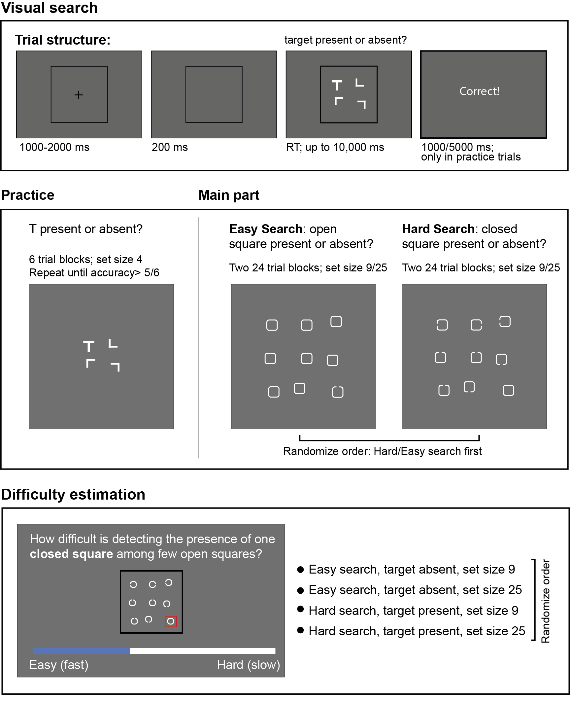
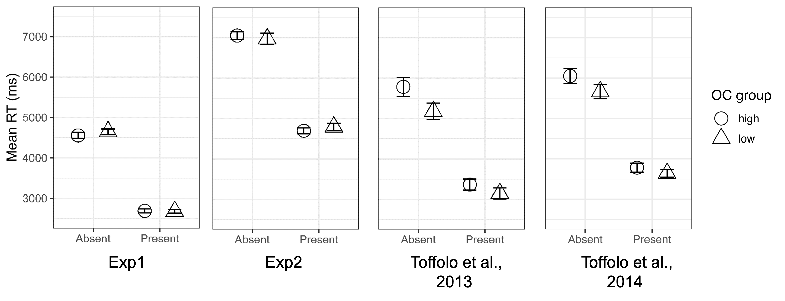

```{r setup, include = FALSE, warning=FALSE}

library('groundhog')
groundhog.library(c(
  "tidyverse",
  "broom",
  "lmerTest",
  "ggpubr",
  "cowplot",
  "caret",
  "papaja",
  "patchwork",
  "wesanderson",
  "reshape2", 
  "rlang",
  "Matrix",
  "lvmisc"
),"2023-09-01", ignore.deps = c('knitr', 'xfun'), 
force.install=TRUE)
#tolerate.R.version = '4.1.2'
```

```{r analysis-preferences}
 # Seed for random number generation
 set.seed(42)
 knitr::opts_chunk$set(cache.extra = knitr::rand_seed)
```

<!-- # Introduction  -->

Theories on obsessive-compulsive disorder (OCD) emphasize the pivotal role of pathological doubt in the disorder's phenomenology [@dar2004; @darSeekingProxies2021; @rasmussen1989; @reed1985; @shapiro1965] . This persistent doubt is reflected in lowered confidence in memory, decision making, perception and other cognitive functions, which give rise to repetitive checking rituals that, paradoxically, only serve to intensify the doubt [@vandenhout2003]. In the lab, doubt and checking behavior are commonly manifested in slow reaction times. For instance, in a study by @sarig2012, participants with high and low obsessive-compulsive tendencies (OC+; OC- respectively) were asked to judge the exact midpoint on a continuum of colors. In another study by @rotge2008, patients with OCD had to compare two images and determine whether they were identical or different. In both studies, obsessive-compulsive tendencies were associated with slower reaction times, presumably driven by the need to check. Such findings have been interpreted as indicating that OC+ participants require more evidence when faced with uncertainty in perceptual decision-making tasks [@banca2015; @hauser2017].

  The present study focused on the finding that OC+ participants took more time than OC- participants to identify when a target was absent from a visual search array, whereas no such difference was observed when the target was present [@toffolo2013]. These findings have been replicated [@toffolo2014] and extended to a clinical sample, where they were found to be specific to patients with OCD and absent in those suffering from anxiety [@toffolo2016].  In these experiments, checking behavior was operationalized as search time, and high and low uncertainty were operationalized by means of contrasting target-present and target-absent trials. Relatively longer search times for the OC+ group in target-absent trials were interpreted as perseverative checking behavior under mild uncertainty. 
  
  While decisions about absence are indeed commonly accompanied by lower levels of subjective confidence compared to decisions about presence [@mazorDistinctNeuralContributions2020; @mazorRegisteredReport2021], they are also qualitatively different from decisions about presence, as they cannot be based on direct perceptual evidence. To determine that a target is absent, one must believe that if the target were present, they would have been able to perceive it: a form of inference that requires counterfactual thinking and reliance on self-knowledge [@mazorInferenceAbsence2021]. Therefore, an alternative mechanism behind the longer search times in target-absent trials among OC+ participants could be a specific difficulty with inference about absence, rather than simply heightened sensitivity to uncertainty. 
  
  To illustrate the differences between inference about presence and inference about absence, consider an example. Imagine you are going to a party and have planned to meet your friend there. You arrive at a big house with several floors and many rooms, but unfortunately, your phone battery dies so you can’t contact your friend. In the “target-present” scenario, you run into your friend and can conclude with confidence that he is present. However, how does the situation unfold in the “target-absent” scenario, where your friend has not in fact arrived at the party? You navigate the space searching for your friend without success. At what point during this process would you conclude that your friend is absent, that is, that if they were there you would have found them by now? As this example shows, the "target-absent" situation not only introduces a heightened level of uncertainty, but also involves a decision-making process that is fundamentally different in nature than in the target-present scenario.
  
  Clinical observations provide some support for the idea that people with OCD struggle with inferences about absence. One example is "Hit-and-run OCD", in which individuals feel compelled to mentally or physically retrace their driving route to ensure that they did not kill or injure someone while driving [@hyman2010]. This phenomenon exhibits the classic structure of an OCD symptom, involving an obsessional doubt about potential harm ("Did I run someone over?") and the compulsion to reduce the doubt by checking [@DiagnosticStatisticalManual2013]. It also manifests key properties of inference about absence: To conclude that an accident has not happened, a person needs to rely on the belief that if it did happen, they would have noticed it. Other clinical examples include situations in which people are obsessed with the idea that they may have posted something offensive online without realizing it, and are compelled to check their entire browsing history. 
  
  These clinical examples hint at the possibility that the increased search time for target-absent trials may be due to a specific difficulty in inferring absence rather than a general intolerance of uncertainty. Disentangling which of these two factors contributes to obsessive compulsive phenomenology is a challenging task due to the robust increase in subjective uncertainty in decisions about absence. Nevertheless, certain judgments about absence can be made with relative certainty, such as deciding that there is no red dot in an array of blue dots (“absence pop-out”; @mazorEfficientSearch2022. Here we made use of this fact to distinguish absence-specific versus generic uncertainty effects in the visual search behavior of OC+ individuals. 
  
  In two pre-registered online studies, we conducted a conceptual replication and a direct replication of the visual search study by @toffolo2013. High and low OC participants were presented with visual search displays and asked to decide whether a target was absent or present. Experiment 1 aimed to elucidate whether the increased search times in target-absent trials for OC+ individuals are attributable to a specific difficulty with inference about absence or a general difficulty with handling uncertainty. Following our failure to replicate the original findings in this first experiment, Experiment 2 was designed as a more direct replication of @toffolo2013, using the exact same stimuli and instructions. 
  
## Experiment 1 
  In Experiment 1, we sought to replicate the previously reported differences in target-absent search times between OC- and OC+ individuals, and to decouple absence- from uncertainty- related effects. By introducing an easy target-absent condition, we intended to dissociate specific difficulties with inference about absence from more general difficulties with uncertainty. To our surprise, we observed no group differences in target-absent search times, even for search displays that elicit high levels of uncertainty. We therefore focus our report here on this replication failure, aiming our efforts towards reproducing the original observation of OC+ participants showing longer search times than OC- participants in target-absent trials, but not in target-present ones. Interested readers can find a detailed preregistration document including all our original hypotheses for Experiment 1 at osf.io/yxqu9, and all the additional analysis for our preregistered hypotheses can be found in the appendix of this paper.  
	
```{r load_data, echo=FALSE, warning=FALSE, cache=TRUE}

#load anon jatos data 
df<- read_csv('../data/anon_jatos_results_p1.csv')
df2<- read_csv('../data/anon_jatos_results_p2.csv')

df <- rbind(df, df2)
rm(df2)

#load anon prolific data 
demo_prolific <- read.csv('../data/anon_demo_prolific.csv')


# create OCI data ---------------------------------------------------------

#parse oci data from df 
OCI_df <- df %>%
  filter(grepl('oci', Identifier)) %>% 
  select(subj_id, question, answer_oci) %>% 
  mutate(attention_check = question %in% c("OCI-Attention_check_1","OCI-Attention_check_2")) %>%
  arrange(subj_id, question)%>%
  #arrange it in a long format df 
  group_by(subj_id) %>%
  summarise(oci_overall=sum(as.numeric(answer_oci[!attention_check])), #compute oci general score 
            failed_attention_OCI = answer_oci[question=='OCI-Attention_check_1']!=0 | #attention check failure
            answer_oci[question=='OCI-Attention_check_2']!=2,
            OCI_Absent = answer_oci[question=='OCI-Absent']) %>%
  mutate(
  #split to quartiles based on oci score
    OCI_quantile = as.numeric(cut(oci_overall,
                                  breaks = quantile(oci_overall[!failed_attention_OCI],
                                                    probs = seq(0, 1, 0.25),
                                                    na.rm = T,
                                                    type = 9),
                                  right = F, 
                                  include.lowest = T,
                                  include.highest = T))
  )

# create DASS data ---------------------------------------------------------

#create vectors for DASS subscales. 
DASS_anxiety <- c("DASS-4","DASS-7", "DASS-9", "DASS-15", "DASS-19", "DASS-20")
DASS_depression <- c("DASS-3","DASS-5", "DASS-10", "DASS-13", "DASS-16", "DASS-17","DASS-21")

#parse DASS data from df
DASS_df <- df %>%
  filter(grepl('DASS', Identifier)) %>% 
  select(subj_id, question, answer_dass) %>% 
  arrange(subj_id, question) %>%
  #arrange in a new df 
  group_by(subj_id)%>%
  summarise(DASS_anxiety = sum(as.numeric(answer_dass[question %in% DASS_anxiety])),
            DASS_depression = sum(as.numeric(answer_dass[question %in% DASS_depression])))

# unite dass and oci
questionnaires_df <- left_join(OCI_df, DASS_df,by = "subj_id")


# df of explicit difficulty rating---------------------------------------------------

#get data from df 
difficulty_rating <- df %>% 
  filter(trial_type == "html-slider-response") %>% 
  select(subj_id,test_part,response) %>%
  #retrieve variable names. 
  mutate(difficulty_rating = case_when(str_detect(test_part,"PresentOinC25") ~ "OinC_25_TP",
                                       str_detect(test_part,"Absent09") ~ "CinO_9_TA",
                                       str_detect(test_part,"PresentOinC09") ~ "OinC_9_TP",
                                       str_detect(test_part,"Absent25") ~ "CinO_25_TA")) %>% 
  select(-test_part) %>% 
  
  #adding OCI quantile to difficulty df 
  left_join(questionnaires_df %>% 
              group_by(subj_id) %>%
              summarise(OCI_quantile=first(OCI_quantile)) %>% 
              select(subj_id, OCI_quantile), 
            difficulty_rating,
            by = "subj_id")

# visual search df -------------------------------------------------------------

search_df <- df %>% 
  filter(trial_type == "p5vs_yn_small_grid") %>%
  select(trial_type,trial_index,subj_id,sequence,target_position,
          subj_id,set_size,target_present,
         RT,test_part,correct,search_type) %>% 
# unite search and questionnaire dfs together 
  left_join(questionnaires_df,
                       by = "subj_id") %>% 
  #unite search df with demo prolific 
  left_join(.,demo_prolific,
            by = "subj_id")

#recode variables 
search_df$target_present<-search_df$target_present=='TRUE'
search_df$RT <- as.numeric(search_df$RT)
search_df$correct <- as.numeric(as.logical(search_df$correct))
search_df$set_size <- as.factor(search_df$set_size)
 

# Rejecting participants with more than 15% error trials -----------------------

rejection_df <- search_df %>% 
  group_by(subj_id) %>% 
  summarise(accuracy = mean(correct),
            mean_error=1-accuracy) %>% 
  mutate(reject = accuracy<0.85)

rejected_num <- sum(rejection_df$reject=='TRUE')


# flag bad trails
search_df <- search_df %>% rowwise() %>% 
  mutate(under_100 = as.numeric(RT <= 100)) 


#filter out participants for accuracy and attention check 
search_df <- left_join(search_df, 
                       rejection_df %>% select(subj_id, reject), 'subj_id') %>%
  # filter(reject=='FALSE' | failed_attention_OCI == 1)
  filter(reject=='FALSE' & failed_attention_OCI == 0) %>%
  filter(under_100 == 0)  #filter our trials 
  

#total n after participants removal 
df.N_total <- search_df$subj_id %>% unique() %>% length()

#total n in each quartile 
#search_df %>% select(subj_id, OCI_quantile) %>% unique() %>% select(OCI_quantile) %>% table()


```

# Methods

# Participants

  The research was approved by the Research Ethics Committee of Tel-Aviv University (study ID number 0004169-1). One thousand and four participants were recruited via Prolific (https://prolific.co/) and selected based on their acceptance rate (>95%) and for being native English speakers, located in the UK. The entire experiment took 14 minutes to complete (median completion time: 14 min.). Participants were paid £2 for their participation, equivalent to an hourly wage of £8.57. Participants were assigned into OC+ group if they were in the highest quartile in the OCI-R scores distribution, and to the OC- group if they were in the lowest quartile of this distribution. Due to higher-than-expected exclusion rate, and in deviation from our pre-registered plan to collect 250 participants in each group, our final sample included 213 OC+ participants and 220 OC- participants. The details of our preregistered analysis can be accessed at osf.io/yxqu9.

## Measures

# Visual search task
  The visual search task described in this study was adapted from @mazorEfficientSearch2022, with stimuli intended to replicate the ones used in @toffolo2013. The task consisted of four blocks, each containing 24 trials of searching for either a closed or an open square. The search items were white on a dark grey background. To ensure that participants understood the task, the experiment began with a practice phase consisting of one block with six trials. Each display was presented for a maximum of 10 seconds or until a response was received. If no response was given within 10 seconds, the next trial immediately appeared. During the practice phase, feedback about accuracy was given after each trial: If the response was correct, the word “Correct!” appeared on the screen for one second; If the response was wrong, the word “Wrong!” appeared on the screen for 5 seconds. The extended duration of the word “Wrong” was intended to be aversive, to ensure that participants were paying full attention and motivated to provide accurate responses. In the main part of the experiment, no feedback was given, as was the case in the original paradigm [@toffolo2013]. After completing the practice, participants looked for either a closed square among rotated open squares (‘hard search’; Fig. 1, main part, right panel), or for a rotated open square among closed squares (‘easy search’; Fig. 1, main part, left panel). The difference in difficulty between these two search types is due to a search asymmetry for open edges [@treisman1988]. We further manipulated target presence and set size, resulting in a 2X2X2 design (Search type: 'easy-search' or 'hard-search'; Target: present/absent; set size: 9 or 25). Block order was counterbalanced between participants: for half of the participants, it was two blocks of 'easy-search' followed by two blocks of 'hard-search'; for the other half, the order was reversed. For all participants, a change in the target was highlighted between the second and third blocks. A message in large font reading "Target changed" was displayed on the screen, followed by a verbal instruction to pay attention to the new target. The trial order within individual blocks was fully randomized (figure 1). 
  
``` {r figure_1, fig.cap="Figure 1 - Overview of experimental Design. Top panel: each visual search trial started with a centered black fixation cross. Middle panel (Practice): After reading the instructions, participants completed practice trials, searching for a rotated T among rotated L's in 6-trial blocks until they achieved a minimum accuracy of 0.83 (no more than one error). Middle panel (Main part): The primary experiment comprised 96 trials in four blocks, with the target identity changing after two blocks. Each 24-trial block followed a 2x2 design, manipulating set size (9 or 25) and target presence (present/absent). Bottom panel: Search difficulty estimation: participants used their mouse to rate search difficulty on a continuous scale. In questions about target-present searches, the target was marked with a red square."}

```
  
# Obsessive–Compulsive Inventory-Revised (OCI-R; Foa et al., 2002). 
The OCI-R is an 18-item self-report measure of OCD symptom severity. Responders are asked to rate their level of distress pertaining to 18 statements in the past month on a five-point scale ranging from 0 (Not at all) to 4 (Extremely). The OCI-R has been shown to have good validity, test-retest reliability and internal consistency in both clinical [@foa2002] and non-clinical samples [@hajcak2004]. 

# Depression, Anxiety and Stress Scales-21 (DASS-21; Lovibond & Lovibond, 1995).
The DASS-21 is a 21- item self-report questionnaire that is divided into three seven-item subscales to measure dimensional components of depression, anxiety, and stress. Each individual item is evaluated on a four-point scale, ranging from 0 (‘the item does not apply to me at all’) to 3 (‘the item applies to me very much or most of the time’). Respondents are asked to reflect upon the relevance of each statement to their experiences over the past week. The DASS-21 has shown high reliability, validity, and internal consistency within both clinical groups and community sample [@lovibond1995; @antonyPsychometricProperties42Item; @henry2005] In this study only the depression and anxiety scales were used.

## Procedure

Experiment Structure. A static version of Experiment 1 can be accessed at: https://noamsarna.github.io/ocd_visual_search/experiments/demos/exp1/.

  Participants were first instructed about the experiment's structure, which comprised three parts: the visual search task, questions about the visual search task, and the two inventories: OCI-R and DASS-21. Then, they received written instructions about the visual search task. Specifically, they were asked to report, as accurately and quickly as possible, whether a target stimulus was present or absent by pressing the J and F keys, respectively. To familiarize participants with the task structure and response keys, they were first presented with six practice trials, in which the target stimulus was a rotated T, and distractors were rotated Ls. Practice trials were delivered in one block of six trials, and the main part of the experiment started only once participants responded correctly on at least five trials. 
  
  After completing two of the four visual search blocks, participants were encouraged to take a short break. The main part of the experiment was followed by questions designed to evaluate the subjective difficulty of this part of the task. Participants were asked to rate the difficulty of noticing the presence or absence of a certain target among different distractors (more information about this in the appendix). Following the difficulty estimation, participants completed the OCI-R  and DASS-21. We included two attention check questions among the OCI-R items, asking participants to select a certain answer (‘If you read this question, check the option ‘Not at all’).
  
  The order and timing of experimental events were determined pseudo-randomly by the Mersenne Twister pseudorandom number generator, initialized to ensure registration time-locking [@mazorNovelToolTimelocking2019]. 


## Data Analysis
# Exclusion Criteria  

  Participants were excluded if they made more than 15% errors in the main part of the experiment or for having extremely fast or slow reaction times (below 100 milliseconds or above 5 seconds) in more than 25% of the trials. Participants were also excluded from the analysis if they failed one or more of the attention checks. In total, 106 out of 1004 participants were excluded from the analysis. For the remaining participants, error trials and trials with response times below 100 milliseconds or above 5 seconds were excluded from the response-time analysis.

# Hypotheses and analysis plan 
  
  As detailed above, Experiment 1 was initially designed to test several hypotheses about the behavior of individuals high on obsessive-compulsive tendencies (OC+) in a visual search paradigm. Specifically, Experiment 1 aimed to distinguish between general difficulties with uncertainty and specific issues related to making inferences about absence in OC+ individuals. In the following analysis we focus only on our attempt to replicate the results of Toffolo and colleagues (2013). Results related to our preregistered hypotheses can be found in the appendix.   

# Transparency and openness 

We used `r cite_r("r-references.bib")` for all our analyses. A detailed preregistration document for Experiment 1 can be accessed at osf.io/yxqu9. All analysis scripts and anonymized data are available at github.com/Noamsarna/ocd_visual_search.

# Results

```{r analyze_data, cache=TRUE, include=FALSE}

# Perceived difficulty pre-processing -------------------------------------

difficulty_rating_by_condition <- difficulty_rating %>% 
  mutate(condition=case_when(str_detect(difficulty_rating, "_TA") ~ "Absent",
                             str_detect(difficulty_rating, "_TP") ~ "Present")) %>% 
  group_by(difficulty_rating, condition) %>%
  summarise(mean = mean(as.numeric(response), na.rm = T),
            sd = sd(as.numeric(response), na.rm = T)) %>% 
  ungroup() 

#difficulty rating with oc quantile 
difficulty_rating_by_condition_with_oci <- difficulty_rating %>% 
  mutate(condition=case_when(str_detect(difficulty_rating, "_TA") ~ "Absent",
                             str_detect(difficulty_rating, "_TP") ~ "Present")) %>% 
  group_by(difficulty_rating, condition, OCI_quantile) %>%
  summarise(mean = mean(as.numeric(response), na.rm = T),
            sd = sd(as.numeric(response), na.rm = T)) %>% 
  ungroup() %>% 
  filter(OCI_quantile=='1' | OCI_quantile=='4') %>% 
  mutate(OCI_quantile_factor = recode(OCI_quantile, '1'='low', '4'='high'))

# Summary dfs  ------------------------------------------------------------

#create a df in which every participant gets a mean score for each search option (8)
search_summary <- 
  search_df %>% 
  filter(correct==1) %>% #only correct trials 
  group_by(subj_id, set_size,search_type, target_present, OCI_quantile) %>% 
  summarise(mean_rt = mean(RT, na.rm = T),
            median_rt = median(RT, na.rm = T)) %>%
  ungroup() 


toffolo_data <- search_df %>%
  filter(set_size == 25) %>% 
  filter(search_type == "OinC") %>% 
  arrange(subj_id, target_present)


by_sub_toffolo <- toffolo_data %>% 
  group_by(subj_id, target_present, OCI_quantile, 
           oci_overall,
           DASS_anxiety, DASS_depression, Age) %>% 
  summarise(N = n(),
            mean_RT = mean(RT, na.rm = T),
            median_RT = median(RT, na.rm = T),
            sd_RT = sd(RT, na.rm = T)) %>% ungroup() %>% 
  mutate(log_mRT = log(mean_RT))

# Extracting slopes ------------------------------------------------------------------

#Reordering set size to get the slopes for the effect of going from 9 to 25. 
search_df$set_size <- relevel(as.factor(search_df$set_size), '9')

#extracting slopes 
search_slopes_df <- search_df %>%
  filter(correct==1) %>% #only correct trials 
  group_by(subj_id,search_type,target_present) %>%
  nest() %>%
  mutate(model = map(data, ~ lm(RT ~ set_size, data =.)),
         tidy = map(model, ~ tidy(.x))) %>%
  unnest(tidy) %>%
  # we are interested in the slope, i.e., the effect of set size.
  filter(term=='set_size25')

search_slopes_df<- left_join(search_slopes_df, questionnaires_df %>% 
                               select(subj_id, OCI_quantile, oci_overall, DASS_depression, DASS_anxiety),
                             by='subj_id') 


slopes_table <-search_slopes_df %>% 
  group_by(OCI_quantile, search_type, target_present) %>% 
  summarise(mean(estimate)) %>%
  filter(OCI_quantile==1 | OCI_quantile==4)


```


```{r DR_h3, echo=FALSE, cache=TRUE}
  
  # Toffolo replication plots -----------------------------------------------------

exp1_mean_RT_fig <- by_sub_toffolo%>% 
    filter(OCI_quantile == 1 | OCI_quantile == 4) %>% 
    mutate(oci_type = ifelse(.$OCI_quantile == 1, "Low OC (OC-)", "High OC (OC+)")) %>% 
    select(subj_id, target_present, oci_type, mean_RT)  %>%
    ggplot(aes(x = target_present, y = mean_RT,  group = oci_type, shape = oci_type)) +
    stat_summary(fun = mean,
                 geom = "point",
                 position = position_dodge(0.9),
                 size = 5) +
    stat_summary(fun.data = mean_se,
                 geom = "errorbar",
                 width = 0.4,
                 position = position_dodge(0.9)) +
    # stat_summary(fun = mean,
    #              geom = "line",
    #              position = position_dodge(0.9)) +
    scale_shape_manual(values = c("High OC (OC+)" = 1, "Low OC (OC-)" = 2)) +
    scale_x_discrete(labels = c("FALSE" = "Absent", "TRUE" = "Present")) +
    theme_bw() +
    theme(axis.title.x = element_blank(),
          text = element_text(size = 12)) +
    ylab('Mean RT (ms)')+
    labs(shape = "OC group")+ 
    coord_cartesian(ylim = c(2500,7500))
  
  
#ggsave(filename = "exp_1_results.png",width = 4, height = 3, dpi = 1500)  


H3.df <- toffolo_data %>% 
  filter(OCI_quantile==1| OCI_quantile==4) %>%
  group_by(subj_id, OCI_quantile, target_present) %>%
  summarise(mean_RT=mean(RT)) %>% 
  ungroup()

```
# Replication of group differences in target-absent RT
  To directly replicate group differences in target-absent RTs (Toffolo et al., 2013, 2014, 2016), we focused on the difficult search with the larger set size (set size = 25). We conducted a mixed-effects ANOVA, with mean response time (RT) as the dependent variable, group (OC+ vs. OC-) as a between-subjects variable, and target presence (present vs. absent) as a within-subjects variable. Specifically, we tested for an interaction between group and target presence, followed by a pattern wherein the mean RT difference between the OC+ and OC- groups would be significantly more pronounced in target-absent trials. Contrary to our expectations, the analysis did not reveal a significant interaction between group and target presence, `r apa_print(afex::aov_ez("subj_id", "mean_RT", H3.df, between = "OCI_quantile", within = "target_present"))$statistic$OCI_quantile_target_present` (figure 2, Exp1; preregistered hypothesis 3).

  Similarly, when we used our entire sample (the four quartiles), and replaced the group variable (OC+; OC-) with the complete OCI-R scale, we found no interaction between OCI-R score and the presence of the target (preregistered hypothesis 9; β̂=-0.07, 95% CI [-2.48,2.35], t(941.54)=-0.05, p=.957). No significant group differences were observed when accounting for anxiety and depression either (preregistered hypothesis 10; β̂=8.62, 95% CI [-21.50,38.74], t(463.53)=0.56, p=.575). There were also no significant RT differences between groups during the task’s initial trials, prior to the accumulation of any experience (preregistered hypothesis 8; F(1,360)=0.93, p=.336). Lastly, we observed no significant differences between the groups in their self-reported measures of task difficulty. Detailed calculations and results for all these hypotheses are provided in the Appendix for further reference.

## Experiment 2 
  In Experiment 1, target-absent search times were not significantly slower in OC+ compared to OC- individuals. While this stands in contrast to previous reports (Toffolo et al., 2013, 2014, 2016), our experiment differed from the original study in several respects. Most notably, search times in this study (~4.5s for target-absent and ~2.6s for target-present) were overall shorter compared to those in Toffolo et al. (2013) (~5.5 for target-absent and ~3.5s for target-present). We therefore considered the possibility that the task used in Experiment 1 may have been less challenging and potentially insufficient to elicit doubt and trigger checking behavior. In order to directly investigate this hypothesis, Experiment 2 employed the original stimuli from Toffolo et al. (2013) in an online sample to ascertain whether the failure to reproduce the effect resulted from an excessively easy task. 


```{r Exp2_load_data, warning=FALSE, cache=TRUE, include=FALSE}

# Pre processing  ---------------------------------------------------------

#load df from jatos 
exp2.jatos_df <-read_csv("../data/Exp_2_anon_jatos_results_10July2023.csv")


failed_practice <- exp2.jatos_df %>% 
  filter(trial_index != "trial_index") %>%
  group_by(subj_id) %>% 
  summarise(max_trail = max(as.double(trial_index, na.rm = T)),
            failed_practice = max_trail <= 42) %>% 
  select(subj_id, max_trail,failed_practice)  

exp2.jatos_df <- left_join(exp2.jatos_df, failed_practice)

n_failed_practice <- failed_practice %>% pull(failed_practice) %>% sum()

total_valid_n <- exp2.jatos_df %>%
  filter(failed_practice=='FALSE') %>%
  pull(subj_id) %>%  n_distinct()


#load prolific df 
exp2.demo_prolific<-read.csv("../data/Ex2_anon_demo_prolific.csv")
exp2.demo_prolific$subj_id <- as.factor(exp2.demo_prolific$subj_id)

#merge df
exp2.jatos_df$subj_id <- as.factor(exp2.jatos_df$subj_id)
exp2.jatos_df <- left_join(exp2.jatos_df, exp2.demo_prolific, by='subj_id')


#parse oci data from df 
exp2.OCI_df <- exp2.jatos_df %>%
  filter(failed_practice=='FALSE') %>% 
  filter(grepl('oci', Identifier)) %>% 
  select(subj_id, question, answer_oci) %>% 
  mutate(attention_check = question %in% c("OCI-Attention_check_1","OCI-Attention_check_2")) %>%
  arrange(subj_id, question)%>%
  #arrange it in a long format df 
  group_by(subj_id) %>%
  summarise(oci_overall=sum(as.numeric(answer_oci[!attention_check])), #compute oci general score 
            failed_attention_OCI = answer_oci[question=='OCI-Attention_check_1']!=0 | #attention check failure
              answer_oci[question=='OCI-Attention_check_2']!=2,
            OCI_Absent = answer_oci[question=='OCI-Absent']) %>%
  mutate(
    #split to quartiles based on toffolo 2013 scores 
    OCI_quantile = case_when(oci_overall>=17 ~ "high", 
                             oci_overall<=5 ~ "low",
                             TRUE ~ 'else'))

#count how many participants in each group 
exp2.OCI_df %>% group_by(OCI_quantile) %>% count()


# merge data with oci 
exp2.jatos_df <- left_join(exp2.jatos_df, 
                      exp2.OCI_df %>% select(subj_id, oci_overall, OCI_quantile, OCI_Absent),
                      by='subj_id')

############ create a df for the checking task 

exp2.checking_task <- exp2.jatos_df %>% 
  filter(trial_type == "image-keyboard-response") %>%
  filter(isPractice=='FALSE') %>% 
  select(trial_type,trial_index,subj_id,condition,
         rt,correct, isPractice, OCI_quantile, oci_overall, OCI_Absent)

#create a table making sure every participant have 50 trials, 25 absent and 25 present 
checking_table <-exp2.checking_task %>% group_by(subj_id) %>% 
  count(condition)

#recode variable
exp2.checking_task$rt <-as.numeric(exp2.checking_task$rt)

# accuracy df  -----------------------------------------------------------
exp2.checking_task$correct <- exp2.checking_task$correct=='TRUE' #change to Boolean 

exp2.checking_task <- exp2.checking_task %>% group_by(subj_id) %>% 
  mutate(mean_acc = mean(correct)) #calculate mean accuracy per subject 

#create accuracy df with acc score and OCI group per subject 
acc_data_frame <- exp2.checking_task %>% 
  group_by(subj_id) %>% select(subj_id, mean_acc, OCI_quantile) %>% slice(1)

#Create variables of accuracy in standard deviation units to exclude participants 
acc_data_frame$Zscore <-scale(acc_data_frame$mean_acc)[,1]

#take a look on overall accuracy scores 
acc_data_frame %>% 
  group_by(OCI_quantile) %>% 
  summarise(mean_acc=mean(mean_acc))

#Sanity check - standardized values should have: mean=0 and SD=1.  
round(mean(acc_data_frame$Zscore), 2)
round(sd(acc_data_frame$Zscore), 2)

#mark participant who had error greater than Z>-2.5
acc_data_frame$remove <-acc_data_frame$Zscore<(-2.5)

#merge acc df with the checking df 
exp2.checking_task <- left_join(exp2.checking_task, acc_data_frame)

#remove participants who had more than Z>-2.5 errors. Three participants are removed. 
exp2.checking_task <-exp2.checking_task %>%
  filter(remove=='FALSE')

 checking_by_sub <- exp2.checking_task %>% 
  filter(OCI_quantile!='else') %>% 
  group_by(subj_id, condition, OCI_quantile,
           oci_overall) %>%
  summarise(N = n(),
            mean_RT = mean(rt, na.rm = T),
            median_RT = median(rt, na.rm = T),
            sd_RT = sd(rt, na.rm = T)) %>% ungroup() %>%
  mutate(log_mRT = log(mean_RT)) %>% 
  mutate(oci_type = ifelse(.$OCI_quantile == 'high', "High OC (OC+)", "Low OC (OC-)")) %>% 
  mutate(target_present = ifelse(.$condition=='ABS', "Absent", "Present"))


```


## Method 
# Participants
  Two hundred twenty-six participants were recruited via Prolific. To maximize statistical power for a group comparison, we invited former participants whose OCI-R scores were in the top or bottom quartile in Exp. 1. In line with our preregistered stopping rule, we kept data collection until we had invited all participants in the first and fourth quartiles from our previous experiment (n=220; n=213, respectively). Participants completed the OCI-R questionnaire again in the present study (the test-retest reliability for the OCI-R yielded a Pearson's correlation coefficient of r = .87, p < 0.001), and were assigned to the OC+/OC- groups based on the cut-off scores from Toffolo et al., 2013 (OCI-R total score ≥ 17 for the OC+ group; OCI-R total score ≤ 5 for the OC- group). Our final sample consisted of 110 OC+ participants and 68 OC- participants. The entire experiment took 12 minutes to complete, and participants were paid £1.8 for their participation, equivalent to an hourly wage of £9.

## Material
# Visual search task
  We used the original stimuli from Toffolo et al. (2013), which were kindly provided to us by Marieke Toffolo. The visual search task consisted of one block of 50 individual search displays, each containing 25 elements. Half of the search displays were target-absent trials, in which 25 squares with a gap in one of the four edges were presented, and the other half were target-present trials, in which 24 open squares were presented along with one closed square: the target. As in Experiment 1, the experiment began with a practice phase consisting of four search displays (two target-absent and two target-present). In the practice phase, participants received feedback on their response accuracy and could move to the next part of the experiment only after successfully completing all four trials. The practice phase was repeated until the participant’s performance was perfect or until it was repeated more than three times, at which point the experiment terminated. In the practice and test phase each trial lasted for a maximum of 10 seconds or until a response was received. If no response was given within 10 seconds, the next trial was presented. In the main part of the experiment, no feedback was given.

## Procedure
  A static version of Experiment 2 can be accessed here: https://noamsarna.github.io/ocd_visual_search/experiments/demos/exp2/  Experiment 2 was similar to Experiment 1 with the following exceptions. First, the search task was more challenging due to a larger search grid, which meant larger distances between stimuli, as well as reduced stimulus size. Second, Experiment 2 did not contain an assessment of perceived difficulty, comprising only a visual search followed by the same questionnaires as in Experiment 1. Third, to make it identical to Toffolo et al. (2013), practice trials in Experiment 2 involved the same stimuli as the main blocks. Fourth, participants were instructed to press the spacebar to move to the search display screen, at which point the search display appeared immediately . Finally, the visual search part of the experiment included only the hard search type: detecting a closed square among open squares. 
  
  The preregistered analysis plan can be accessed at the following link: https://osf.io/8a5mr. As in Experiment 1, we employed the Mersenne Twister pseudorandom number generator to ensure that our preregistration preceded data collection (Mazor et al., 2019). Since Experiment 2 served as a direct replication, we adopted the same rejection criteria as Toffolo et al. (2013), so that participants were excluded if their error count exceeded 2.5 standard deviations from the mean error rate of the entire sample. As in Experiment 1, participants were also excluded from the analysis if they failed to answer correctly one or more attention-check questions. 


# Results
```{r Exp2_analyze_data, warning=FALSE, cache=TRUE, include=FALSE}

#plot figure of mean RT for each group  
exp_2_results<-
checking_by_sub %>% 
select(subj_id, target_present, oci_type, mean_RT)  %>%
  ggplot(aes(x = target_present, y = mean_RT,  group = oci_type, shape = oci_type)) +
  stat_summary(fun = mean,
               geom = "point",
               position = position_dodge(0.9),
               size = 5) +
  stat_summary(fun.data = mean_se,
               geom = "errorbar",
               width = 0.4,
               position = position_dodge(0.9)) +
  # stat_summary(fun = mean,
  #              geom = "line",
  #              position = position_dodge(0.9)) +
  scale_shape_manual(values = c("High OC (OC+)" = 1, "Low OC (OC-)" = 2)) +
  scale_x_discrete(labels = c("FALSE" = "Absent", "TRUE" = "Present")) +
  theme_bw() +
  theme(axis.title.x = element_blank(),
        text = element_text(size = 12)) +
  ylab('Mean RT (ms)')+
  labs(shape = "OC group")+ 
  coord_cartesian(ylim = c(2500,7500))

#ggsave(filename = "exp_2_results.png",width = 4, height = 3, dpi = 1500)  


# make a planned contrast df in which every participant has one raw with a difference score of the mean 
#target absent search time minus the mean target present search time. 

planned_df <- exp2.checking_task %>% 
  filter(rt!='null') %>%   filter(OCI_quantile!='else') %>% 
  group_by(subj_id, condition, OCI_quantile, oci_overall) %>% 
  summarise(mean_RT =mean(rt))%>% ungroup

#long to wide format 
planned_wide <- spread(planned_df, key = condition, value = mean_RT)

#adding difference score 
planned_wide <- planned_wide %>% mutate(RT_diff = ABS- PRE) 
#mean for target present trials - 
round(mean(unlist(planned_df[planned_df$condition=='PRE', 'mean_RT'])), 2)

#mean for target absent trials -
round(mean(unlist(planned_df[planned_df$condition=='ABS', 'mean_RT'])), 2)


Exp2_H1_desc <-planned_df %>% group_by(condition) %>% summarise(mean_rt=mean(mean_RT),
                                                                sd=sd(mean_RT))


#number of errors per participants 
#mark trials of missing rt data 
exp2.checking_task$missing_rt <- exp2.checking_task$rt %>% is.na()

exp2.checking_task <-exp2.checking_task %>% 
  group_by(subj_id) %>% 
  mutate(num_error=50-(sum(correct))) 


exp_2_mean_error_rate <- round(mean(exp2.checking_task$num_error), 2) 
exp_2_SD_error <- round(sd(exp2.checking_task$num_error), 2)


```

*Task validation*  

To validate our paradigm and demonstrate that target-absent searches are more difficult, we tested for an effect of condition (target-absent vs. target-present) on mean search times, collapsed across both groups. Our results revealed the expected difference, whereby the mean response time for target-absent responses (M=`r printnum(Exp2_H1_desc[1 ,2], digits=0)` ms, SD=`r printnum(Exp2_H1_desc[1 ,3], digits=0)` ms) was significantly longer than the mean response time for target present responses (M= `r printnum(Exp2_H1_desc[2 ,2], digits=0)` ms, SD= `r printnum(Exp2_H1_desc[2 ,3], digits=0)` ms, `r apa_print(t.test(mean_RT~condition, data=planned_df, alternative='greater', paired=T))$statistic`) 

*Direct replication*

  The primary aim of Experiment 2 was to examine the interaction between group (OC+ vs. OC-) and condition (target-absent vs. target-present). Following the analysis performed in Toffolo et al., (2013), we conducted a one-tailed t-test using the difference in search times (mean RT absent - mean RT present) as the dependent variable and group (OC+ vs. OC-) as the independent variable.  In contrast to Toffolo et al. (2013), where presence-absence differences in reaction time were more pronounced among OC+ participants, in our replication sample the one-tailed t-test revealed no significant differences between the groups, `r apa_print(t.test(RT_diff~OCI_quantile, data=planned_wide, alternative="greater"))$statistic`, providing no evidence for the expected interaction. Notably, the numeric trend of the interaction in our sample was driven by OC+ shorter response time than OC- in target-present trials, rather than by longer response time for target-absent responses (Figure 2, Exp2). This pattern is different from that reported by Toffolo et al. (2013), where OC+ participants were slower in both search types, but particularly in target-absent searches (Figure 2, Toffolo et al., 2013). 

``` {r figure_2, fig.cap="Figure 2 - Results from Experiment 1 (preregistered H3), Experiment 2 (preregistered H2) and Toffolo et al., 2013, 2014. Mean reaction times for target-absent and target-present trials (X-axis). Error bars represent the standard error of the mean. Shapes represent the OC groups: Circle for OC+; Triangle for OC-."}

```

# Discussion

In two preregistered, large-sample studies, we found no evidence of prolonged search time among OC+ participants in target-absent trials. Experiment 1 was a conceptual replication, ensuring that the basic structure of the task remained consistent with Toffolo et al., (2013), while varying the uncertainty level and manipulating stimulus set size. No significant differences emerged between the search times of OC+ and OC- participants across any conditions. Subsequently, in Experiment 2, we meticulously replicated the original study methodology and design, employing identical stimuli, task structure, and instructions. Nevertheless, Experiment 2 yielded no evidence of group differences in search times. Collectively, these null results are in disagreement with the previous findings by Toffolo and colleagues (2013, 2014, 2016). In discussing these results below, we examine in detail all the potential disparities between our studies and the original studies we sought to replicate. 

# Differences between the two studies
  Experiment 1 was a conceptual replication attempt. Our main objective was to disentangle whether the prolonged search time of OC+ participants observed in target-absent trials was primarily due to a general sensitivity to uncertainty [@tolin2003] or alternatively reflected a more specific difficulty with inference about absence (Mazor, 2021). However, no group differences materialized in any of the tested conditions, and consequently there were no differential patterns to account for. 
  We considered the possibility that search difficulty in Experiment 1 might have been insufficient to elicit doubt and trigger repetitive checking (reflected in longer RT). In comparison to Toffolo et al., (2013), in Experiment 1 we used a smaller and denser search grid, with thicker stimulus outlines, resulting in an overall easier task. Indeed, mean search times in Experiment 1 were faster by about one second relative to those in Toffolo et al. (2013). In addition, the grid in Experiment 1 was small and organized enough to theoretically allow sequential search (going over the grid line by line, which could also reduce the level of uncertainty). With these differences in mind, we designed Experiment 2, in which we aimed to replicate the original study design as close as possible. 
  In Experiment 2 we used the same stimuli, task structure and instructions as in Toffolo et al., (2013). In accordance with Experiment 1, however, we again found no group differences between OC+ and OC- participants in search time. In this experiment, the overall (collapsing over groups) mean search time was slower than both Toffolo et al., (2013) and Toffolo et al., (2014), and more similar to the mean search time in the clinical OCD sample in Toffolo et al., (2016), ruling out the possibility that insufficient task difficulty might explain the lack of differences between the groups (see Fig. 2).

*Online vs. in person design*

  The most notable difference between our experiments and those conducted by Toffolo et al., (2013, 2014, 2016) lies in our use of an online setting versus their use of in-person data collection. Completing tasks online, as opposed to in a laboratory setting, generates more technical noise: unexplained variance driven by technical variation. This technical noise can be categorized into two main types: noise stemming from disparities in software and technology and noise resulting from technical and situational heterogeneity, such as variable computers, monitors, or distances from the screen [@hilbig2016]. In the following paragraphs, we consider the potential impact of these two factors on the different results observed. 
  
  First, differences in technical noise can be instigated by differences in software: Matlab in previous studies of visual search in OCD, versus JavaScript in ours. In an effort to shed light on this specific matter, @deleeuwPsychophysics2016 carried out a study comparing the response time distributions derived from a lab-based psychophysics toolbox (Matlab) and an online experiment powered by JavaScript. The results revealed near-identical response times between the JavaScript and Matlab experiments, with a negligible and constant delay for the JavaScript engine of approximately 25 milliseconds. Therefore, @deleeuwPsychophysics2016 concluded that the two setups demonstrated equal sensitivity to response time alterations resulting from experimental manipulations.
  
  Second, participants in our sample completed the visual search task in their own homes, using a range of computers, displays, and keyboards, rather than in a controlled lab environment with a fixed screen as in Toffolo et al. (2013, 2014, 2016). Importantly, a consistent finding across research on online studies is that technical variation does not pose a significant issue [@hilbig2016]. Simulation studies have demonstrated minimal impact of technical variance on statistical power and the precision of effect size estimates [@brand2012]. Key behavioral findings in psychology, including those observed in the Stroop and flanker tasks, as well as effects reliant on much smaller time constants, like attentional blink and subliminal priming, have been successfully replicated in web-based studies [@crump2013]. 
  
  Particularly strong evidence for the comparability of lab-based vs. web-based findings comes from a study which utilized a fully randomized design for reaction time effects [@hilbig2016]. Participants were randomly assigned to complete a lexical decision task either in a lab setting with standard software for psychological experiment, in a lab using a browser version, or on the web using their own computer and space. The results showed that the words frequency effect (manifested in different RT) was comparable in magnitude across all three conditions. Taken together, these studies show that whereas some variations between settings in RT exist, they are minor, especially when the outcome measure is RT alterations resulting from experimental manipulations. Even if we consider the constant delay of JavaScript compared to Matlab tasks (~25ms, @deleeuwPsychophysics2016), and add to it to the difference between a lab setting with E-prime and a web setting with a browser (34 ms, Table 2 in @hilbig2016) we get a difference of ~60 ms, an order of magnitude smaller than the difference between OC+ and OC- participant in target-absent searches reported by Toffolo et al., (2013), which was ~600 ms. 

*Comparison of accuracy*

  One discrepancy between our dataset and the one reported by Toffolo et al., (2013) is worth highlighting. The mean error rate across all trials in Toffolo et al. (2013) (M=5.87, SD=5.96) was lower than in our Experiment 2 (M=`r printnum(exp_2_mean_error_rate)`, SD=`r printnum (exp_2_SD_error)`). To examine whether less accurate or possibly less engaged participants could have skewed our results, we reevaluated the data from Experiment 2, this time including only participants whose error rate fell below the raw error rate exclusion criterion (19 errors out of 50 trials) employed by Toffolo et al. (2013). Despite applying this strict exclusion criterion, the crucial interaction between group and condition did not reach statistical significance, as elaborated in the supplementary results. 

*Feeling observed*

  An interesting perspective on our failure to replicate a well-documented psychological finding comes from a recent paper discussing the failed attempts to replicate the widely recognized facial-feedback hypothesis [@noahWhenBothOriginal2018]. According to this paper, both the original study and its replication failures were valid, with the difference between the two outcomes attributed to the presence of a camera. The theory proposed to elucidate this disparity suggests that individuals alter their behavior when they perceive themselves to be observed by others. The theory posits that individuals, feeling watched, adopt an external perspective on themselves, thus shifting their reliance from solely internal information to information perceivable by potential observers. In a series of studies supporting this theory, the researchers showed that when people are in an ‘objective state’, where they think of themselves from the perspective of an external observer, they are less influenced by subjective experiences such as metacognitive experiences [@noahThinkingOneselfObject2018]. This hypothesis introduces the possibility that the eye tracker used in Toffolo’s experiments, while clearly different from a conventional camera, may have created a sense of being observed, leading participants to lessen their reliance on internal cues. 
  
  As previously noted, the psychological processes required for making target-present and target-absent decisions are distinct, with interesting links to the dichotomy of feeling observed versus not. Decisions regarding target presence can be readily justified to an outsider ("Look at the second row, the third item on the left; there it is!") in a way that is not true of decisions about target absence ("Look at the grid; do you see how the target isn't there?"). Therefore, if individuals indeed adopt an external perspective of themselves when feeling observed, this may impact their decision-making to different extents as a function of target presence or absence. We leave it for future studies to explore this hypothetical link and its potential interaction with obsessive-compulsive tendencies. 


*Inference about absence in the clinic and in the lab* 

  Having analyzed the disparities between our experiments and those we attempted to replicate, we turn to revisit the earlier discussion on clinical manifestation of inference about absence in OCD. Despite a promising theoretical relationship and a cluster of related clinical manifestations (‘hit and run OCD’), we found no effect of obsessive-compulsive tendencies on inference about absence. This failure may be rooted in the notion of perceived responsibility. @salkovskis1985 posits that individuals with OCD frequently demonstrate an inflated sense of responsibility, perceiving themselves as key players in harm prevention. This heightened sense of responsibility gives rise to compulsive behavior directed at mitigating potential threats [@salkovskis1985]. In 'hit and run OCD' behavior, the compulsion does not directly aim to prevent future harm but rather to verify that it has not occurred and possibly avoid secondary damage. Importantly, responsibility was not manipulated in the visual search task utilized in our study, as missing the target had virtually no adverse effects.
  
  Furthermore, in the clinical example of “hit and run”, the compulsion is associated more with a recollection of an event rather than its direct experience. For example, an individual may obsess over the possibility that they may have run someone over without realizing, which primarily involves their memory of the event. Indeed, most findings related to reduced confidence in individuals with OCD have been observed in relation to memory rather than perception (for review see @dar2022). This implies that cognitive biases and distortions in OCD could predominantly affect memory functions, more than perception. Future research exploring inference issues about absence in OCD may consider focusing on memory and incorporate a condition that involves personal responsibility. 
  
  Before concluding, we wish to examine our study through the lens of replicability. In an influential publication, @tackett2017 strongly advocated for broadening the discussion on replicability in psychology, emphasizing the need for clinical psychologists to rigorously implement replicability practices. Our attempt at replication embedded several of the pivotal elements underscored by @tackett2017. Firstly, prior to data collection, we documented our hypotheses, analysis plan, and criteria for data exclusion, ensuring these decisions were established prior to the collection and review of data. Furthermore, we utilized the preregistration time-locking tool as detailed by @mazorNovelToolTimelocking2019, thereby guaranteeing that our registration indeed preceded the data collection process. Secondly, while the effect of prolonged search time for OC+ has been replicated twice by Toffolo and her colleague (2014, 2016), our study represents the first independent replication attempt. Thirdly, in both experiments, we conducted a power analysis to determine our sample size, and in Experiment 2, adhered to the same criteria for determining OC+ and OC- used by Toffolo et al., (2013) to minimize population deviations. Lastly, in the interest of promoting research transparency and reproducibility, we have made our raw data, analysis scripts, and task codes publicly available. By incorporating these practices, we have strived to enhance the robustness of our study, hoping it may serve as a helpful reference for future research into visual search patterns in OCD.

## Conclusion 

  The presented findings diverge from those of previous studies, as we were unable to replicate the effect of prolonged search time for high OC participants in target-absent trials. To the very least, this replication failure indicates that the original effect may be constrained to a specific setting, thus limiting its generalizability to other contexts. More broadly, this study serves to advocate for the application of open science practices in clinical psychology research, consistent with those widely utilized within the realms of social and cognitive psychology, in order to foster methodological integrity and ensure the reliability of findings.	


\newpage

# References

::: {#refs custom-style="Bibliography"}
:::

---
appendix: "appendix.Rmd"
---


\newpage

# (APPENDIX) Appendix {-}

```{r child = "appendix.rmd"}
```

