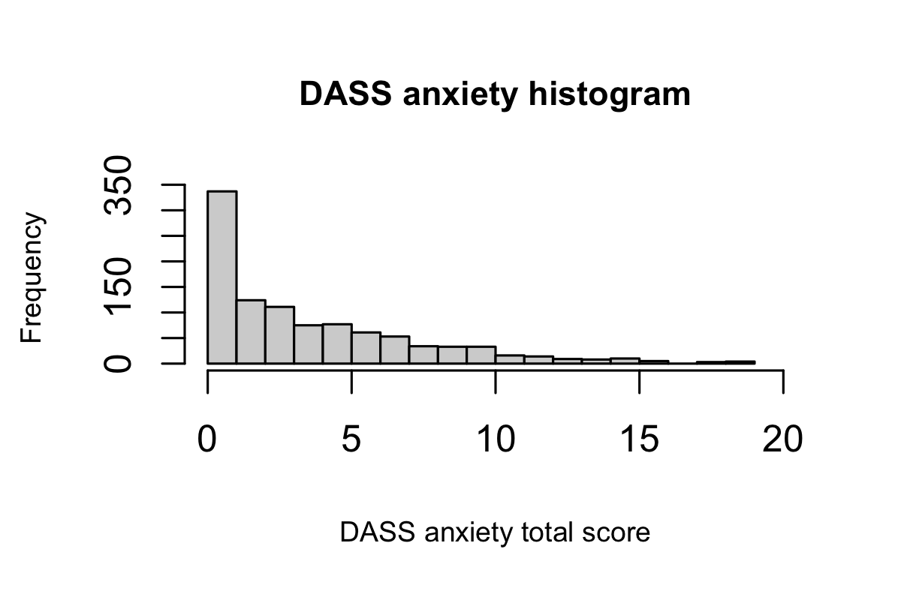

# Supplementary methods, Experiment 1

## Search termination without task experience

  To assess participants' search termination without task experience, i.e., decisions about target absence made before ever experiencing target-present trials (Mazor & Fleming, 2022), the first two trials of the first and third blocks were always target-absent trials (one of each set size), presented in randomized order. This was unknown to the participants.

## Estimation of search difficulty

  After the visual search task, participants were asked to rate the difficulty of detecting a specific target, or inferring its absence, among various distractors. Each question referred to a picture of a trial with a red square around the target if it was present, or no marking at all if the target was absent (so that participants were not actively searching for the target in the difficulty estimation part). Participants then rated the perceived difficulty on a continues scale, dragging the curser from left to right (see figure 1; difficulty estimation). They rated four different trial types: detecting the presence of one closed square among many open squares, detecting the presence of one closed square among few open, detecting the absence of one open square among many closed squares and detecting the absence of one open square few closed squares. We focused on these four trials as this was our most intriguing hypothesis, comparing easy target-absent trials to more challenging target-present trials.

## OCI-R Psychometric properties 
**Figure A1**
*Histogram for the OCI-R total score* 
```{r figure A1"}

```

The OCI-R demonstrated excellent internal consistency in our sample, with a Cronbach's alpha of `r printnum(OCI_alpha_cronbach$alpha)`. The distribution of scores showed a slight positive skewness `r printnum(OCI_R_skewness)`, indicating a modest asymmetry with a tail extending towards higher scores. Additionally, the kurtosis of `r printnum(OCI_R_kurtosis)` suggests a mesokurtic distribution, closely resembling the normal distribution in terms of its peak and tail characteristics. OCI-R cutoff scores for the low OC group (OC-) were defined as OCI-R < 11, and OCI-R cutoff scores for the high OC group were determined as OCI-R > 28. 

## DASS Psychometric properties 
**Figure A2** 
*Histogram for the DASS anxiety sub-scale*
```{r figure A2}

```

The DASS anxiety sub-scale demonstrated excellent internal consistency in our sample, with a Cronbach's alpha of `r printnum(DASS_anx_alpha_cronbach$alpha)`.

**Figure A3** 
*Histogram for the DASS depression sub-scale*

```{r figure A3}
knitr::include_graphics("figures/DASS_dep_hist.png")
```

The DASS depression sub-scale demonstrated excellent internal consistency in our sample, with a Cronbach's alpha of `r printnum(DASS_dep_alpha_cronbach$alpha)`.


# Supplementary results, Experiment 1

  In this section we present the results for all of our preregistered hypotheses. A detailed preregistration document including all our original hypotheses for Experiment 1 at github.com/Noamsarna/ocd_visual_search/tree/main/experiments/Experiment1. For all of our hypotheses regarding search time provided in this section, we used search slopes as our dependent measure. Subject-wise search slopes were extracted for each combination of search type (easy/hard search) and presence of the target (present/absent), resulting in four search slopes estimates for each participant – easy-present; hard-present; easy-absent; hard-absent. These slopes were computed by fitting a linear regression model to predict reaction time as a function of set size, with one intercept and one set-size term.

## Hypotheses 1 and 2 - Task validation

  To validate our paradigm structure and to assess whether we successfully created an easier search by leveraging search asymmetries (i.e., switching between the target and distractors), we first examined the difference in slopes between the two search types (easy/hard), regardless of target presence (pre-registered hypothesis H1). As anticipated, a one-tailed paired t-test demonstrated a steeper slope for the difficult search `r printnum (H1.desc[2,3], digits=0)` ms/item compared to the easy search `r printnum (H1.desc[1,3], digits=0)` ms/item, `r apa_print(t.test(estimate~search_type, data=search_slopes_df, paired=T))$statistic`. Furthermore, a one-tailed paired t-test revealed that target-present slopes in the hard search `r printnum (H2.desc[2,3], digits=0)` ms/item were steeper than target-absent slopes in the easy search `r printnum (H2.desc[1,3], digits=0)` ms/item, `r apa_print(t.test(estimate~group, data=H2.df, paired=T))$statistic` (pre-registered hypothesis H2).
  The initial two control comparisons served to validate that we successfully designed a target-absent condition that was easier than a target-present condition, thereby experimentally decoupling decision certainty from target presence, and enabling to measure their independent effects on search time as a function of obsessive-compulsive tendencies.

## Hypothesis 3 -- Direct replication

See main text.

## Hypothesis 4: Extension of Toffolo et al. (2013), search slopes

Following the previous analysis which addressed the replication of Toffolo and colleagues, we conducted the same mixed-effects ANOVA, with group (OC+/OC-) as between-subject and target presence (present/absent) as within-subject variables, but with search slopes (reaction time as a function of set size) as a dependent variable. Consistent with our findings for Hypothesis 3, a mixed-effects ANOVA revealed no statistically significant interaction between group and target presence `r apa_print(afex::aov_ez("subj_id", "estimate", data=H4.df, between = "OCI_quantile", within = "target_present"))$statistic$OCI_quantile_target_present`, again providing no evidence for selective slowing of OC+ as compared to OC- individuals in target-absent trials.


## Hypothesis 5: Low-uncertainty inference about absence

Originally, our primary focus was on this hypothesis, examining the effect of obsessive-compulsive tendencies on target-absent search times in an easy, low-uncertainty, search setting (set size =9). However, given our failure to replicate a group difference in the hard search (set size =25; Hypotheses 3 and 4), a significant result here seemed unlikely. Indeed, a mixed-effects ANOVA with group as a between-subjects variable and target presence as a within-subjects variable did not reveal a significant interaction between group and target presence in the easy search, `r apa_print(afex::aov_ez("subj_id", "estimate", H5.df, between = "OCI_quantile", within = "target_present"))$statistic$OCI_quantile_target_present`.

## Hypothesis 6: Model comparison

  Our experimental design aimed to differentiate between difficulties arising from higher uncertainty and those arising from the absence of the target. To achieve this, we used two search types: a hard search (searching for a closed square among open squares), and an easy search (searching for an open square among closed squares). Additionally, we manipulated the presence or absence of the target. To determine whether uncertainty or absence had a greater impact on OC+ search time, we constructed two competing regression models that differed only in their interaction terms (table A1). Beyond the search type and the target presence predictors, the first model (M1) included the interaction between group and search type, while the second model (M2) included the interaction between group and target presence (table A1). Since the two models differ only in their last interaction effect, their complexity (that is, the number of fitted coefficients) is the same, which allowed us to compare these models directly. We compare model performance using their Akaike Information Criterion (AIC), with lower AIC values indicating a better fit of the model to the data [@burnham2004multimodel]. The model comparison table shows that both models have the similar AIC values (difference in AIC scores \< 3) suggesting that the interaction between group and target presence does not explain search time to a greater extent than the interaction between group and search type.

```{r table_1, echo=FALSE, results='asis'}

apa_table(H6.model_acc_table,
          caption = 'Table A1 – Model comparison table',
          note = 'The two models (M1, M2) are concerning hypothesis 6. AIC value of M1 was scaled to zero, to make the differences clearer.  Differences in AIC greater than 10 are considered as decisive evidence supporting the model with the lower numerical value. '
          )

```

## Hypotheses 7 and 8 - First trials

  In this analysis, we focused on the two first trials of each search type. These trials are special in that by the time of making these responses, participants haven't yet experienced target presence. First, we compared the slopes of the two types of searches (easy/hard search) to see if they were different already in the first trials, using a two-tailed paired t-test (H7). This allowed us to isolate pre-specified search termination strategies from ones that were acquired throughout the course of the experiment.

  We found a significant difference between the slope of the easy search (`r print_num(search_slopes_first_trials_desc[1,4], digits=0)` ms/item) and the slope of the hard search (`r print_num(search_slopes_first_trials_desc[2,4], digits=0)` ms/item) in the first trials of each block type `r apa_print(t.test(estimate~search_type, data=search_slopes_df_first_t, paired=T))$statistic`. This significant difference between the search slopes indicates that subjects' search termination rule was sensitive to the difference between the two search types prior to having experience with the easy and hard search tasks.

  We next asked whether this effect of search type on target-absent search times was similar for OC+ and OC- individuals (H8). Using a mixed-effects ANOVA with slope as a dependent variable and group and search type as the two between- and within-subject independent variables, we tested for the interaction of group (OC+/OC-) with search type in the first trials. We did not find a significant interaction between search type and group on first-trial slopes `r apa_print(afex::aov_ez("subj_id", "estimate", search_slopes_df_first_t, between = "OCI_quantile", within = "search_type"))$statistic$OCI_quantile_search_type`.

## Hypothesis 9: Correlations between OC tendencies and search slopes

  In order to strengthen the validity of our results, we reanalyzed our main hypothesis (H6, M2) incorporating the full spectrum of OC scores (raw OCI total scores). We employed a mixed-effects regression model, which was analogous to M2 from Hypothesis 6, but with the key difference of employing the complete range of total OCI scores, as opposed to focusing solely on the top and bottom quartiles. As this revised model included all participants, not just those with high and low OC scores, it was fitted on a different dataset than M2 in Hypothesis 6. Due to this fundamental difference in the underlying data, a direct comparison of these models would not be appropriate. Consequently, our focus was on the interaction term involving the full range of OCI scores. The interaction between search type and total OCI score was found to be non-significant (`r apa_print(m3)$full_result$oci_overall_target_presentTRUE`).

## Hypothesis 10: Controlling for depression and anxiety

  Finally, in order to test the possible effects of depression and anxiety, we added DASS subscales of depression and anxiety scores as predictors into our model. We used a mixed-effects regression model identical to the second model in hypothesis 6, except for the addition of depression and anxiety as predictors. The interaction between group and target presence remained below the significance threshold after adding depression and anxiety to the model (`r apa_print(m4)$full_result$target_presentTRUE_OCI_quantile`).

## Exploratory analysis - Measuring the perceived difficulty of participants

  In order to compare explicit metacognitive knowledge with behavior, we collected perceived difficulty ratings for the different search tasks. A discrepancy between perceived difficulty and task performance in the OC+ group would suggest a dissociation between action and knowledge, in line with previous findings [@vaghi2019action]. We examined two search types: target-absent easy searches and target-present hard searches, with set sizes of 9 and 25. For both groups, discrepancies between perceived difficulty and mean response time were observed in the same direction: despite overall slower search times in easy target-absent searches, these searches were perceived as easier than hard target-present trials (figure A4).
  
**Figure 4A** 
*Relationship between perceived difficulty and reaction times (RT) for high and low OC participants*

```{r figure 4A}

```
*note* Rows display mean RT (top-row) and mean estimated difficulty (bottom-row). Columns represent results for the entire sample (left column) the OC+ group (Middle column) and OC- (Right column). Reaction times and difficulty ratings for easy target-absent and hard target-present trials appear in grey and red, respectively. Error bars represent the standard error of the mean. Right side of the figure shows illustration for easy target absent and hard target present searches with the small set size (9).

```{r reanalyze EXP2_H2, cache=TRUE, include=FALSE}


#reanalyze experiment 2 hypothesis 2 
# make a planned contrast df in which every participant has one raw with a difference score of the mean 
#target absent search time minus the mean target present search time. 

planned_df_exc_19 <- exp2.checking_task %>% 
  filter(num_error < 19) %>% 
  filter(rt!='null') %>%   filter(OCI_quantile!='else') %>% 
  group_by(subj_id, condition, OCI_quantile, oci_overall) %>% 
  summarise(mean_RT =mean(rt))

#long to wide format 
planned_wide_exc_19 <- spread(planned_df_exc_19, key = condition, value = mean_RT)

#adding difference score 
planned_wide_exc_19 <- planned_wide_exc_19 %>% mutate(RT_diff = ABS- PRE) 

planned_wide_exc_19 %>% 
  group_by(OCI_quantile) %>% 
  summarise(mean_diff = mean(RT_diff))


# #Statistical analysis with exclusion of error<19 ---------------------------------------------------

planned_wide_exc_19 %>% 
  t.test(RT_diff~OCI_quantile, data=., alternative="greater")


```

# Supplementary results, Experiment 2

## Reanalysis of Experiment 2, preregistered hypothesis 2

  Here we reanalyze Experiment 2, preregistered hypothesis 2, this time including only participants who had error rate smaller than the actual error rate used in @toffolo2013 (number of error \<19). The one-tailed t-test revealed no significant differences between the groups, `r apa_print(t.test(RT_diff~OCI_quantile, data=planned_wide_exc_19, alternative="greater"))$statistic`, providing no evidence for the expected interaction. Here too, a numeric interaction in the expected direction was driven by a descriptive difference in the timing of target-present responses, rather than by target-absent responses.
